# 🤖 Autonomous AI Blog Generation System
## End-to-End Multi-Agent Architecture: From Topic to Published Article

> **Stack:** LangGraph · Ollama (Mistral) · SearxNG · Stable Diffusion v1.4 · Streamlit · ChromaDB  
> **Pattern:** Orchestrator–Worker with Router, Planner, Researcher, Writers, Image Agent & Reducer  
> **Constraint:** 100% Free & Open-Source · Fully Local · No API Keys Required

---

## Table of Contents

1. [Project Discovery](#1-project-discovery)
2. [Agentic System Design](#2-agentic-system-design)
3. [Agent Workflow & State Management](#3-agent-workflow--state-management)
4. [Technical Architecture & Frameworks](#4-technical-architecture--frameworks)
5. [Tooling & Infrastructure](#5-tooling--infrastructure)
6. [Ethical, Safety & Scaling Considerations](#6-ethical-safety--scaling-considerations)
7. [Implementation Roadmap](#7-implementation-roadmap)
8. [Project Folder Structure](#8-project-folder-structure)

---

## 1. Project Discovery

### Core Problem

Writing a high-quality, research-backed blog post is time-consuming. It requires topic research, outline planning, web search, fact gathering, multi-section drafting, citation management, and image sourcing — a workflow that normally takes hours. This system collapses all of that into a single autonomous pipeline that operates end-to-end with no human intervention beyond the initial topic prompt.

### Target Users

This system is built for three primary audiences:

**Content Creators & Bloggers** who need a research-first drafting assistant that can write 2,000+ word articles with citations and images automatically embedded. **Developer / ML Portfolio Builders** who want a demonstrable, interview-ready agentic AI project that showcases orchestrator–worker patterns, parallel execution, RAG, and multi-modal generation. **Small Teams & Startups** who need to produce authoritative SEO content at scale without a dedicated content team.

### Real-World Use Cases

1. **Tech Blog Automation** — A developer blogs about AI trends; the system researches, writes, and illustrates a full post in under 5 minutes.
2. **Educational Content Generation** — A teacher gives a topic; the system produces a well-cited, structured explainer with illustrative images.
3. **Product/Company Newsletter** — Marketing feeds in a theme; multiple articles are generated in parallel for A/B distribution.
4. **Research Digests** — Feed in a subject (e.g., "Quantum Computing 2025"); the system synthesizes the latest web findings into a readable digest.
5. **Interview Portfolio Demo** — Demonstrates mastery of LangGraph state machines, parallel node execution, RAG, and diffusion model APIs in one cohesive project.

### Constraints, Assumptions & Success Metrics

**Constraints:**
- All models run locally via Ollama (Mistral 7B) and Hugging Face `diffusers`
- Search must work without paid API keys (SearxNG self-hosted or DuckDuckGo)
- Target hardware: consumer GPU with at least 8 GB VRAM (RTX 3060+) or CPU-only fallback

**Assumptions:**
- Internet access is available during research phase
- The operator has Docker installed for SearxNG
- Stable Diffusion v1.4 is acceptable image quality for the use case

**Success Metrics:**
- End-to-end blog generation in under 6 minutes on consumer hardware
- At least 5 images generated per post (1 feature + 4 section-level)
- All citations are real URLs extracted from SearxNG results
- Blog output is a single well-structured Markdown or HTML file
- Zero hallucinated citations (all links are live URLs from search results)

### Scope Boundaries

**In-Scope:** Topic intake → planning → parallel web research → parallel section writing → image generation → citation injection → final blog assembly → Streamlit UI preview

**Out-of-Scope:** Automatic publishing to WordPress/Ghost (can be added as Phase 4), human-in-the-loop editing UI, fine-tuning of Mistral, video or audio generation, multilingual support (initial version)

---

## 2. Agentic System Design

### Agent Roster

The system uses **7 specialized agents** organized in a two-tier hierarchy: a Supervisor layer (Router + Planner + Reducer) and a Worker layer (Researcher × N, Writer × N, Image Agent).

---

#### 🧠 Agent 1: Router Node
**Role:** Entry point and intent classifier.  
**Responsibilities:**
- Receives the raw user topic string
- Determines whether the topic requires live web research or can be handled from LLM knowledge alone
- Routes to Planner with a `research_required: bool` flag
- Handles malformed or empty inputs gracefully

**Decision Logic:**
```
IF topic contains time-sensitive keywords (latest, 2025, new, recent, current)
  OR topic is a factual technical subject with evolving information
→ research_required = True
ELSE
→ research_required = False (LLM knowledge-only path)
```

**Tools:** None (pure LLM reasoning node)

---

#### 📋 Agent 2: Planner Node
**Role:** Strategic decomposition of the topic.  
**Responsibilities:**
- Generates a structured blog outline (title, 4–6 section names, descriptions, and target word counts)
- Produces a list of focused search queries (one per section that needs research)
- Assigns image prompt strings for each section
- Outputs a `BlogPlan` structured object that drives all downstream agents
- Determines parallelization strategy: which sections can be written concurrently

**Output Schema (Pydantic):**
```python
class Section(BaseModel):
    id: str
    title: str
    description: str
    word_count: int
    search_query: Optional[str]
    image_prompt: str

class BlogPlan(BaseModel):
    blog_title: str
    feature_image_prompt: str
    sections: List[Section]
    research_required: bool
```

**Tools:** Ollama/Mistral with structured output enforced via `model.with_structured_output(BlogPlan)`

---

#### 🔍 Agent 3: Researcher Worker (Parallel × N)
**Role:** Web research specialist, one instance per section needing research.  
**Responsibilities:**
- Takes a single `search_query` from the plan
- Executes 2–3 targeted searches via SearxNG or DuckDuckGo
- Fetches and parses top result page content
- Extracts key facts, statistics, and quotes
- Returns a `ResearchResult` with summarized content + source URLs

**Tools:**
- `SearxSearchWrapper` (from `langchain_community.utilities`) pointed at local SearxNG Docker instance
- `DuckDuckGoSearchRun` as fallback
- `BeautifulSoup4` for lightweight HTML content parsing
- Web fetch via `httpx` for full-page content retrieval

**Parallelization:** LangGraph's `Send()` API dispatches N simultaneous researcher instances — one per section that has a `search_query`.

---

#### ✍️ Agent 4: Writer Worker (Parallel × N)
**Role:** Section content generation, one instance per blog section.  
**Responsibilities:**
- Receives its section plan + research results (if any)
- Drafts the full section body with proper headings, paragraph flow, and inline `[citation]` markers
- Writes to match the target word count from the plan
- Embeds an `[IMAGE_PLACEHOLDER_{section_id}]` token where the image should appear
- Returns a completed `SectionDraft` with content and raw citation references

**Tools:** Ollama Mistral via `langchain_community.llms.Ollama` with carefully structured section writing prompt

**Parallelization:** All writer workers fire simultaneously using LangGraph's `Send()` API. Each uses its own `WorkerState` (isolated from others), and all outputs are merged into `completed_sections` via the `Annotated[list, operator.add]` state key pattern.

---

#### 🎨 Agent 5: Image Generation Agent (Parallel × N)
**Role:** Visual content creator, one instance per planned image.  
**Responsibilities:**
- Receives the image prompt from the plan (feature image or section image)
- Calls Stable Diffusion v1.4 via Hugging Face `diffusers` pipeline
- Saves generated images to `outputs/images/` with deterministic filenames
- Returns file path and alt text for embedding in final blog

**Tools:**
```python
from diffusers import StableDiffusionPipeline
pipe = StableDiffusionPipeline.from_pretrained("CompVis/stable-diffusion-v1-4")
```
- Runs on GPU if available, CPU fallback with reduced steps
- Image size: 512×512 (feature), 512×384 (section images)
- Guidance scale: 7.5, inference steps: 30 (GPU) / 15 (CPU)

**Parallelization:** Image generation is dispatched in parallel with writer workers using `asyncio.gather()` wrapped in LangGraph task nodes.

---

#### 📎 Agent 6: Citation Manager Node
**Role:** Reference integrity enforcer.  
**Responsibilities:**
- Aggregates all `ResearchResult` objects from Researcher workers
- Builds a global citation registry: `{[N]: {url, title, snippet}}`
- Resolves `[citation]` markers in writer output to numbered references `[1]`, `[2]`, etc.
- Deduplicates URLs
- Appends a formatted "References" section to the blog

**Tools:** Pure Python string processing; no LLM required for this node

---

#### 🔗 Agent 7: Reducer / Assembler Node
**Role:** Final synthesis and document assembly.  
**Responsibilities:**
- Receives all completed `SectionDraft` objects, image paths, and resolved citations
- Orders sections according to the original `BlogPlan`
- Substitutes `[IMAGE_PLACEHOLDER_{id}]` tokens with actual Markdown image syntax ``
- Injects citations inline
- Writes the final blog as a `.md` file and optionally converts to `.html`
- Generates a metadata block (title, estimated read time, date, tags)

**Tools:** Python string templating, `markdown` library for HTML conversion

---

### Inter-Agent Communication Pattern

The system uses a **hierarchical supervisor pattern with event-driven parallel dispatch**:

- The Supervisor (Router → Planner) manages top-level control flow
- Workers (Researchers, Writers, Image Agents) communicate exclusively through **shared graph state** — they never call each other directly
- The `Send()` API in LangGraph enables the Planner to dynamically spawn N workers based on the number of sections at runtime
- All worker outputs flow back to the shared state via `Annotated[list, operator.add]` — a reducer function that safely merges concurrent writes
- The Reducer node reads the fully assembled state and produces the final artifact

---

## 3. Agent Workflow & State Management

### Full Agent Lifecycle

```
INITIALIZATION
└── User enters topic in Streamlit UI
└── GraphState initialized with topic string
└── LangGraph graph compiled and invoked

ROUTING (Router Node)
└── LLM classifies topic → sets research_required flag
└── Conditional edge → Planner

PLANNING (Planner Node)
└── LLM generates BlogPlan (structured output)
└── Plan stored in graph state
└── Parallel dispatch prepared

PARALLEL EXECUTION (Workers — fired simultaneously)
├── N × Researcher Workers
│   └── SearxNG search → page fetch → summarize → return ResearchResult
├── N × Writer Workers (can start with available research)
│   └── Wait for matching ResearchResult → draft section → return SectionDraft
└── N+1 × Image Agent Workers
    └── SD pipeline call → save image → return ImageResult

AGGREGATION (Citation Manager)
└── Merge all ResearchResults
└── Build citation registry
└── Resolve inline citation markers

ASSEMBLY (Reducer Node)
└── Order sections
└── Inject images
└── Inject citations
└── Write final .md + .html files

TERMINATION
└── Output paths stored in graph state
└── Streamlit UI reads output and renders preview
└── Download links activated
```

### State Management Strategy

The entire graph operates on a single typed `GraphState` TypedDict, which is the only object passed between nodes:

```python
from typing import TypedDict, Annotated, List, Optional
import operator

class GraphState(TypedDict):
    # Input
    topic: str
    
    # Router output
    research_required: bool
    
    # Planner output
    plan: Optional[BlogPlan]
    
    # Worker outputs — operator.add merges parallel writes safely
    research_results: Annotated[List[ResearchResult], operator.add]
    completed_sections: Annotated[List[SectionDraft], operator.add]
    generated_images: Annotated[List[ImageResult], operator.add]
    
    # Reducer outputs
    citation_registry: dict
    final_markdown: str
    final_html: str
    output_path: str
```

**Short-Term Memory:** The `GraphState` dict acts as the working memory for a single blog generation run. All agents read from and write to this state.

**Long-Term Memory (Optional Phase 2):** ChromaDB stores previously generated blogs and their research summaries as vector embeddings. On new runs, the Planner queries ChromaDB to avoid re-researching recently covered topics, and Writer workers can draw on prior research context for faster generation.

**Caching:** Research results are cached to disk as JSON per search query hash. If the same query is re-run within 24 hours, the cached result is used, bypassing SearxNG calls.

### Asynchronous Orchestration

LangGraph's `Send()` API enables true parallel worker dispatch within the Python event loop:

```python
def dispatch_workers(state: GraphState):
    """Dispatch all researcher, writer, and image workers in parallel"""
    sends = []
    for section in state["plan"].sections:
        if section.search_query:
            sends.append(Send("researcher_worker", {"section": section}))
        sends.append(Send("writer_worker", {"section": section}))
        sends.append(Send("image_worker", {"section": section}))
    return sends
```

Image generation is the most latency-sensitive step. It runs in a `ThreadPoolExecutor` (since the `diffusers` pipeline is not async-native) wrapped inside a LangGraph task node, keeping it off the main event loop.

### Error Handling, Retries & Fallbacks

Every worker node is wrapped in a try/except with a three-tier fallback strategy:

**Tier 1 — Retry:** On transient failures (network timeouts, Ollama response errors), workers retry up to 3 times with exponential backoff (1s, 2s, 4s).

**Tier 2 — Degraded Fallback:** If a Researcher worker fails after retries, the Writer worker for that section receives an empty `ResearchResult` and writes the section using LLM knowledge alone, marking it with a `[RESEARCH_FAILED]` warning tag.

**Tier 3 — Skip & Continue:** If an Image worker fails, the `[IMAGE_PLACEHOLDER_{id}]` token is replaced with a placeholder text box, and the blog assembly continues without blocking.

LangGraph's built-in checkpointer (using SQLite via `SqliteSaver`) saves graph state after every node completion. If the pipeline crashes mid-run, it can be resumed from the last successful checkpoint rather than starting over.

---

## 4. Technical Architecture & Frameworks

### Stack Justification

**LangGraph** is chosen over CrewAI and AutoGen for this project for three reasons. First, its `Send()` API provides the most elegant native support for the orchestrator–worker scatter-gather pattern. Second, its explicit `TypedDict` state gives full transparency and debuggability over the shared state. Third, it has native SQLite checkpointing for crash recovery and LangSmith integration for observability — both critical for production-grade builds.

**Ollama + Mistral 7B** is the LLM backend. Mistral 7B v0.3 is the best-in-class 7B model for instruction following, structured output generation, and text quality — all essential for a content generation pipeline. It runs at 4-bit quantization (Q4_K_M) on modest consumer hardware and supports tool-calling via its native function format, which LangGraph can leverage for the Router's decision logic.

**SearxNG** (self-hosted via Docker) is the search layer. It is completely free, aggregates Google, DuckDuckGo, Bing, and Wikipedia simultaneously, strips tracking, and integrates natively with LangChain's `SearxSearchWrapper`. DuckDuckGo (`langchain_community.tools.DuckDuckGoSearchRun`) is the zero-setup fallback.

**Stable Diffusion v1.4** via Hugging Face `diffusers` is the image generation engine. SD v1.4 is the specified target, and it generates 512×512 images in ~3–10 seconds on an RTX 3060. For CPU-only environments, step count is reduced to 15 and resolution to 384×384.

**ChromaDB** is the optional long-term vector store. It is in-process (no separate server needed), persists to disk, and integrates directly with LangChain's retriever interface. It stores research summaries and past blog outlines for retrieval-augmented planning.

**Streamlit** provides the UI. It is the fastest path to a functional, shareable frontend with file preview, download buttons, and progress feedback — zero JavaScript required.

### High-Level Architecture Diagram

```mermaid
graph TD
    UI([🖥️ Streamlit UI\nTopic Input]) --> ROUTER

    subgraph SUPERVISOR_LAYER["🧠 Supervisor Layer"]
        ROUTER["🔀 Router Node\nIntent Classification\nresearch_required: bool"]
        PLANNER["📋 Planner Node\nBlogPlan Generation\nStructured Output via Mistral"]
        REDUCER["🔗 Reducer Node\nAssembly + Citation Injection"]
    end

    subgraph WORKER_LAYER["⚙️ Worker Layer (Parallel Execution via Send API)"]
        direction LR
        R1["🔍 Researcher\nWorker 1"]
        R2["🔍 Researcher\nWorker 2"]
        Rn["🔍 Researcher\nWorker N"]

        W1["✍️ Writer\nWorker 1"]
        W2["✍️ Writer\nWorker 2"]
        Wn["✍️ Writer\nWorker N"]

        IM1["🎨 Image\nWorker 1\nSD v1.4"]
        IM2["🎨 Image\nWorker 2\nSD v1.4"]
        IMn["🎨 Image\nWorker N+1\nSD v1.4"]
    end

    subgraph TOOLS["🛠️ Tools & Services"]
        SEARXNG["🌐 SearxNG\n(Docker, Port 8080)"]
        DDGO["🦆 DuckDuckGo\n(Fallback)"]
        OLLAMA["🦙 Ollama\nMistral 7B\n(Port 11434)"]
        SDIFF["🖼️ Hugging Face\nStable Diffusion v1.4"]
        CHROMA["🗄️ ChromaDB\nLong-Term Memory"]
    end

    subgraph STATE["📦 Shared Graph State (TypedDict)"]
        S1["topic · plan · research_required"]
        S2["research_results: List (merged via operator.add)"]
        S3["completed_sections: List (merged via operator.add)"]
        S4["generated_images: List (merged via operator.add)"]
        S5["citation_registry · final_markdown"]
    end

    ROUTER -->|Sets research_required| PLANNER
    PLANNER -->|"Send(researcher_worker, section)"| R1
    PLANNER -->|"Send(researcher_worker, section)"| R2
    PLANNER -->|"Send(researcher_worker, section)"| Rn
    PLANNER -->|"Send(writer_worker, section)"| W1
    PLANNER -->|"Send(writer_worker, section)"| W2
    PLANNER -->|"Send(writer_worker, section)"| Wn
    PLANNER -->|"Send(image_worker, prompt)"| IM1
    PLANNER -->|"Send(image_worker, prompt)"| IM2
    PLANNER -->|"Send(image_worker, prompt)"| IMn

    R1 & R2 & Rn -->|ResearchResult| STATE
    W1 & W2 & Wn -->|SectionDraft| STATE
    IM1 & IM2 & IMn -->|ImageResult| STATE

    STATE -->|All workers complete| CITEMGR["📎 Citation Manager\nURL Registry Builder"]
    CITEMGR --> REDUCER
    REDUCER --> OUTPUT["📄 Output\n.md + .html Blog Post\nWith Images + Citations"]
    OUTPUT --> UI

    R1 & R2 & Rn <-->|"search(query)"| SEARXNG
    SEARXNG -.->|Fallback| DDGO
    W1 & W2 & Wn & ROUTER & PLANNER & REDUCER <-->|"generate(prompt)"| OLLAMA
    IM1 & IM2 & IMn <-->|"pipe(prompt)"| SDIFF
    PLANNER <-->|"similarity_search(topic)"| CHROMA
```



### Component Interaction Sequence

```mermaid
sequenceDiagram
    actor User
    participant UI as Streamlit UI
    participant LG as LangGraph Engine
    participant Router as Router Node
    participant Planner as Planner Node
    participant ResW as Researcher Workers (×N)
    participant WrW as Writer Workers (×N)
    participant ImW as Image Workers (×N+1)
    participant CitMgr as Citation Manager
    participant Reducer as Reducer Node
    participant Ollama as Ollama (Mistral 7B)
    participant Search as SearxNG
    participant SD as Stable Diffusion

    User->>UI: Enter topic: "Future of AI in Healthcare"
    UI->>LG: invoke({"topic": "..."})
    LG->>Router: execute(state)
    Router->>Ollama: classify(topic) → research_required=True
    Router-->>LG: update state
    LG->>Planner: execute(state)
    Planner->>Ollama: generate BlogPlan (structured output)
    Ollama-->>Planner: BlogPlan {title, 5 sections, image prompts, search queries}
    Planner-->>LG: update state with plan

    par Parallel Dispatch via Send() API
        LG->>ResW: Send(researcher_worker, section_1..N)
        LG->>WrW: Send(writer_worker, section_1..N)
        LG->>ImW: Send(image_worker, prompt_0..N)
    end

    par Worker Execution
        ResW->>Search: search(query_1..N)
        Search-->>ResW: results + URLs
        ResW->>Ollama: summarize(results)
        Ollama-->>ResW: ResearchResult × N
        ResW-->>LG: merge into state.research_results

        WrW->>Ollama: write_section(plan + research)
        Ollama-->>WrW: SectionDraft with [citation] markers
        WrW-->>LG: merge into state.completed_sections

        ImW->>SD: generate(prompt, steps=30)
        SD-->>ImW: image.png saved to outputs/images/
        ImW-->>LG: merge into state.generated_images
    end

    LG->>CitMgr: execute(state)
    CitMgr-->>LG: citation_registry built, markers resolved

    LG->>Reducer: execute(state)
    Reducer-->>LG: final_markdown + final_html written to disk

    LG-->>UI: output_path, metadata
    UI->>User: Preview blog post + Download buttons
```



---

## 5. Tooling & Infrastructure

### Backend & Model Serving

**Ollama** serves Mistral 7B on `localhost:11434` with an OpenAI-compatible REST API. All LangGraph nodes call it via `langchain_community.llms.Ollama` or `langchain_community.chat_models.ChatOllama`. For structured outputs (BlogPlan, ResearchResult), `model.with_structured_output(PydanticClass)` is used, which prompts Mistral to respond in JSON schema-compliant format.

```bash
# One-time setup
ollama pull mistral
ollama serve  # runs in background on :11434
```

**Stable Diffusion v1.4** runs via the Hugging Face `diffusers` library, loaded once at application startup into the Image Worker pool to avoid per-image cold-start overhead:

```python
from diffusers import StableDiffusionPipeline
import torch

device = "cuda" if torch.cuda.is_available() else "cpu"
sd_pipe = StableDiffusionPipeline.from_pretrained(
    "CompVis/stable-diffusion-v1-4",
    torch_dtype=torch.float16 if device == "cuda" else torch.float32
).to(device)
sd_pipe.safety_checker = None  # remove NSFW filter for non-public use
```

**SearxNG** runs as a Docker container. A minimal `docker-compose.yml` is included in the project:

```yaml
services:
  searxng:
    image: searxng/searxng:latest
    ports:
      - "8080:8080"
    environment:
      - SEARXNG_SECRET_KEY=changeme
    volumes:
      - ./searxng:/etc/searxng
```

### UI

**Streamlit** provides the frontend. Key features of the UI:

- Topic text input with example prompts
- Real-time progress log (streamed from LangGraph events using `graph.stream()`)
- Section-by-section preview as sections complete
- Final preview pane rendering the generated Markdown blog
- Image gallery showing all generated images
- Download buttons for `.md` and `.html` outputs
- Sidebar for configuration: model temperature, word count targets, number of sections, image dimensions, search engine selection

### Memory & RAG Strategy

**Session Memory:** The `GraphState` TypedDict is the full working memory for one run. It is ephemeral — cleared after each run unless checkpointing is enabled.

**Checkpointing (Crash Recovery):** LangGraph's `SqliteSaver` persists state after every node:
```python
from langgraph.checkpoint.sqlite import SqliteSaver
memory = SqliteSaver.from_conn_string("checkpoints.db")
graph = workflow.compile(checkpointer=memory)
```

**Long-Term RAG (Phase 2):** ChromaDB stores previous blog plans and research summaries. The Planner first checks ChromaDB for any relevant prior research before firing Researcher workers. This makes repeated runs on related topics dramatically faster.

### Logging & Observability

**Structured Logging:** Python's `structlog` library outputs JSON log lines per node execution with timing, token counts, and node name. This feeds into any log aggregator.

**LangSmith Tracing (Optional but Recommended):** Setting `LANGCHAIN_TRACING_V2=true` sends all LangGraph node traces to LangSmith's free tier, giving a visual timeline of every agent's LLM call, tool use, and state mutation. This is the single most powerful debugging tool for multi-agent pipelines.

**Prometheus + Grafana (Phase 3):** Expose metrics via a `/metrics` endpoint (using `prometheus_client`) for generation latency, token throughput, image generation time, and search result quality scores.

### Deployment Options

**Local Development:**
```bash
pip install -r requirements.txt
ollama serve &
docker compose up -d  # SearxNG
streamlit run app/ui.py
```

**Docker Compose (Full Stack):**
```yaml
services:
  app:
    build: .
    ports: ["8501:8501"]
    volumes: ["./outputs:/app/outputs"]
    depends_on: [searxng, ollama]
  ollama:
    image: ollama/ollama:latest
    ports: ["11434:11434"]
    volumes: ["ollama_data:/root/.ollama"]
    deploy:
      resources:
        reservations:
          devices: [{driver: nvidia, count: 1, capabilities: [gpu]}]
  searxng:
    image: searxng/searxng:latest
    ports: ["8080:8080"]
```

**Kubernetes (Phase 3):** Deploy Ollama and SearxNG as separate Deployments with HPA for writer worker pods. Use a Redis-backed LangGraph checkpointer for distributed state persistence.

---

## 6. Ethical, Safety & Scaling Considerations

### Guardrails & Content Safety

**Input Validation (Router Node):** The Router includes a lightweight guardrail prompt that refuses topics requesting harmful content (violence, NSFW, hate speech, dangerous instructions). This is a simple LLM classification before any planning begins:

```python
SAFETY_SYSTEM_PROMPT = """
You are a content safety classifier. Determine if the given topic is appropriate
for a professional blog post. Respond only with {"safe": true} or {"safe": false, "reason": "..."}.
"""
```

**Stable Diffusion Safety:** While the safety checker is disabled by default for local use, it should be re-enabled for any public-facing deployment. The image prompt sent to SD is always derived from the Planner's structured output — it is never a raw pass-through of user input — which limits prompt injection risk.

**Output Content Review:** The Reducer node passes the assembled blog through a final LLM moderation check before writing to disk, flagging any hallucinated statistics or claims that lack citation backing.

### Hallucination Mitigation

The most important anti-hallucination mechanism is the **research-first, write-second order**. Writer workers receive actual search result summaries before writing. They are explicitly instructed to only state facts that appear in the research context and to mark any claim drawn from LLM training data with `[KNOWLEDGE: no citation]` for transparency.

Citations are only inserted from the `citation_registry`, which is built exclusively from live SearxNG URLs — not LLM-generated URLs. This eliminates the common failure mode of LLMs fabricating plausible-looking but non-existent citations.

### Security & Data Privacy

Since all components run locally, no user data is sent to external services. The one exception is DuckDuckGo search queries in fallback mode, which are outbound HTTP requests. For fully air-gapped environments, DuckDuckGo can be replaced with a local Elasticsearch index or Wikipedia dumps.

Access to the Streamlit UI should be restricted to localhost or behind a reverse proxy with basic authentication for any team deployment.

### Performance Optimization & Scaling

**Parallelization** is the primary performance lever. A 5-section blog dispatches 5 Researcher workers, 5 Writer workers, and 6 Image workers simultaneously. Total wall-clock time is dominated by the slowest worker (typically Stable Diffusion), not the sum of all workers.

**Quantization:** Mistral 7B at Q4_K_M quantization runs at approximately 30–50 tokens/second on an RTX 3060, completing a 300-word section in under 15 seconds.

**Batched Image Generation:** All N+1 image requests are submitted to the SD pipeline in a single batch (when GPU memory allows) rather than sequentially, reducing total image generation time by up to 60%.

**Caching:** Search result caching (24-hour TTL, stored as JSON by query hash) eliminates redundant searches. ChromaDB RAG for the Planner node reduces re-planning time for related topics.

---

## 7. Implementation Roadmap

### Phase 1: Core Pipeline (Weeks 1–2) — MVP

**Goal:** Working end-to-end generation with single-threaded execution.

Milestone 1.1: Set up Ollama + Mistral 7B, verify LangChain connection, write a basic Router and Planner node with structured output. Test BlogPlan generation for 5 different topics.

Milestone 1.2: Implement single Researcher worker with SearxNG tool. Verify search results are summarized correctly. Implement the DuckDuckGo fallback and test both paths.

Milestone 1.3: Implement single Writer worker that uses research context. Generate one section at a time. Verify citation markers appear correctly.

Milestone 1.4: Implement SD v1.4 Image Worker for one image. Verify output file saved to disk. Handle CPU fallback.

Milestone 1.5: Implement Citation Manager and Reducer. Produce a complete `.md` blog file. Manually verify output quality on 3 test topics.

**Risk:** Mistral 7B structured output reliability can be inconsistent. Mitigation: use `model.with_structured_output()` with `include_raw=True` and add a retry loop that parses raw JSON if Pydantic validation fails.

---

### Phase 2: Parallelization + State Machine (Weeks 3–4) — Production Core

**Goal:** Full LangGraph parallel graph with Send() dispatch.

Milestone 2.1: Refactor single workers into parallel LangGraph nodes using the `Send()` API. Verify that 5 researcher workers fire simultaneously and their outputs merge correctly into `GraphState` via `operator.add`.

Milestone 2.2: Implement the SQLite checkpointer. Simulate mid-run failures and verify recovery from checkpoint.

Milestone 2.3: Batch all N+1 image generation calls in parallel via `ThreadPoolExecutor`. Measure wall-clock improvement versus sequential.

Milestone 2.4: Add ChromaDB for research caching. Implement Planner's RAG lookup. Verify cache hit on repeated related topics.

**Risk:** Writer workers depend on their section's research results. If researchers for some sections complete after writers start, writers may write without research. Mitigation: implement a lightweight barrier — writers wait for their matching `ResearchResult` to appear in state before generating (check by `section.id`).

---

### Phase 3: UI + Observability (Week 5) — Demo-Ready

**Goal:** Polished, shareable Streamlit interface with full observability.

Milestone 3.1: Build Streamlit app with topic input, section-by-section live preview, image gallery, and download buttons. Wire in LangGraph's `graph.stream()` for real-time progress display.

Milestone 3.2: Configure LangSmith tracing and verify full node-level visibility in the LangSmith dashboard. Add `structlog` for structured local logging.

Milestone 3.3: Write Docker Compose stack (app + Ollama + SearxNG). Test full stack on a clean machine. Document setup in README.

**Risk:** Streamlit's threading model can conflict with LangGraph's async execution. Mitigation: run the LangGraph pipeline in a background thread via `threading.Thread` and use a `queue.Queue` to stream progress events back to the Streamlit session.

---

### Phase 4: Advanced Features (Weeks 6–8) — Portfolio Polish

**Goal:** Extensibility and production hardening.

Milestone 4.1: Add the moderation guardrail node at the Router. Implement content safety scoring for the final output. Add `[KNOWLEDGE: no citation]` flagging in Writer workers.

Milestone 4.2: Implement a Human-in-the-Loop checkpoint using LangGraph's `interrupt_before` mechanism. After the Planner generates the BlogPlan, pause and display the outline in Streamlit for user approval before dispatching workers.

Milestone 4.3: Add multi-model support — allow switching between Mistral 7B, Llama 3.1 8B, and Phi-3 Mini from the Streamlit sidebar. Benchmark quality vs. speed tradeoffs on a standardized test set of 10 topics.

Milestone 4.4: Optional Markdown-to-WordPress export via the WordPress REST API (configurable via `.env`). Add social media excerpt generation (Twitter/X thread, LinkedIn post) as additional Reducer outputs.

**Key Risks Across All Phases:**

- **Ollama Structured Output Failures:** Mistral can occasionally output malformed JSON. Always wrap structured output calls in a retry decorator with raw JSON parsing as fallback.
- **SearxNG Rate Limiting:** Self-hosted SearxNG can get soft-blocked by Google when search volume is high. Mitigation: use multiple search engines (`engines: "duckduckgo,bing,wikipedia"`) and implement request spacing.
- **Stable Diffusion OOM on CPU:** SD v1.4 on CPU requires 8+ GB RAM. Mitigation: reduce to 256×256 resolution on CPU or integrate a lighter model (LCM-LoRA for 4-step generation).
- **Parallel State Merge Race Conditions:** Multiple workers writing to the same state key simultaneously. Mitigation: LangGraph's `operator.add` reducer is designed specifically for this and is the correct primitive — never use a plain overwrite for parallel worker outputs.

---

## 8. Project Folder Structure

```
blog-agent/
│
├── app/
│   ├── ui.py                    # Streamlit frontend — topic input, live preview, download
│   └── config.py                # App-level config: model names, endpoints, output dirs
│
├── agents/
│   ├── router.py                # Router node: intent classification, safety check
│   ├── planner.py               # Planner node: BlogPlan structured output generation
│   ├── researcher.py            # Researcher worker: SearxNG search + content extraction
│   ├── writer.py                # Writer worker: section drafting with research context
│   ├── image_agent.py           # Image worker: Stable Diffusion pipeline wrapper
│   ├── citation_manager.py      # Citation registry builder and marker resolver
│   └── reducer.py               # Final assembler: stitches sections, images, citations
│
├── graph/
│   ├── state.py                 # GraphState TypedDict + Pydantic models (BlogPlan, Section, etc.)
│   ├── graph_builder.py         # LangGraph StateGraph definition: nodes, edges, Send() dispatch
│   └── checkpointer.py          # SQLite checkpointer setup for crash recovery
│
├── tools/
│   ├── search.py                # SearxNG + DuckDuckGo wrappers, fallback logic
│   ├── web_fetcher.py           # httpx + BeautifulSoup content extractor
│   └── image_gen.py             # SD v1.4 pipeline loader + generate() function
│
├── memory/
│   ├── chroma_store.py          # ChromaDB client, collection setup, similarity search
│   └── cache.py                 # Disk-based JSON cache for search results (24hr TTL)
│
├── prompts/
│   ├── router_prompt.txt        # System prompt for intent classification + safety
│   ├── planner_prompt.txt       # System prompt for structured BlogPlan generation
│   ├── researcher_prompt.txt    # System prompt for research summarization
│   ├── writer_prompt.txt        # System prompt for section writing with citation markers
│   └── moderator_prompt.txt     # System prompt for final output safety check
│
├── outputs/
│   ├── images/                  # Generated PNG files (feature + section images)
│   ├── blogs/                   # Final .md and .html blog files
│   └── logs/                    # Structured JSON logs per run
│
├── tests/
│   ├── test_router.py
│   ├── test_planner.py
│   ├── test_researcher.py
│   ├── test_writer.py
│   ├── test_graph_integration.py # End-to-end graph test with 3 standard topics
│   └── fixtures/                # Pre-saved search results for offline unit tests
│
├── docker/
│   ├── docker-compose.yml       # Full stack: app + Ollama + SearxNG
│   ├── Dockerfile               # App container
│   └── searxng/
│       └── settings.yml         # SearxNG engine configuration
│
├── notebooks/
│   └── graph_explorer.ipynb     # Jupyter notebook for interactive graph debugging
│
├── requirements.txt             # Python dependencies
├── .env.example                 # Environment variable template
└── README.md                    # Setup guide, architecture overview, demo GIF
```

### Key File Explanations

`graph/state.py` is the single most important file — it defines every piece of data that flows between agents and must be kept in sync with all node inputs/outputs.

`graph/graph_builder.py` is where the entire LangGraph is assembled. It defines the node-to-node edges, conditional routing logic, and the `dispatch_workers()` function that uses `Send()` for parallel dispatch.

`prompts/` contains externalized prompt files rather than hardcoded strings. This makes prompt iteration fast without touching Python code — critical for tuning output quality.

`tools/search.py` abstracts over SearxNG and DuckDuckGo so the Researcher worker has a single `search(query: str) → List[SearchResult]` interface regardless of which backend is active.

`memory/cache.py` implements a simple disk cache: `cache_key = hashlib.md5(query.encode()).hexdigest()`. This prevents redundant API calls for identical queries across runs.

---

## Quick-Start Reference

```bash
# 1. Clone and install
git clone https://github.com/yourname/blog-agent
cd blog-agent
pip install -r requirements.txt

# 2. Pull Mistral model
ollama pull mistral

# 3. Start SearxNG
docker compose -f docker/docker-compose.yml up -d searxng

# 4. Download Stable Diffusion (first run only, ~4GB)
python -c "from diffusers import StableDiffusionPipeline; StableDiffusionPipeline.from_pretrained('CompVis/stable-diffusion-v1-4')"

# 5. Launch the app
streamlit run app/ui.py
# → Open http://localhost:8501
# → Enter a topic → click Generate
# → Watch agents work in real-time → download your blog post
```

---

*Built with ❤️ using LangGraph · Ollama · SearxNG · Stable Diffusion · ChromaDB — 100% open-source, fully local, zero API keys.*