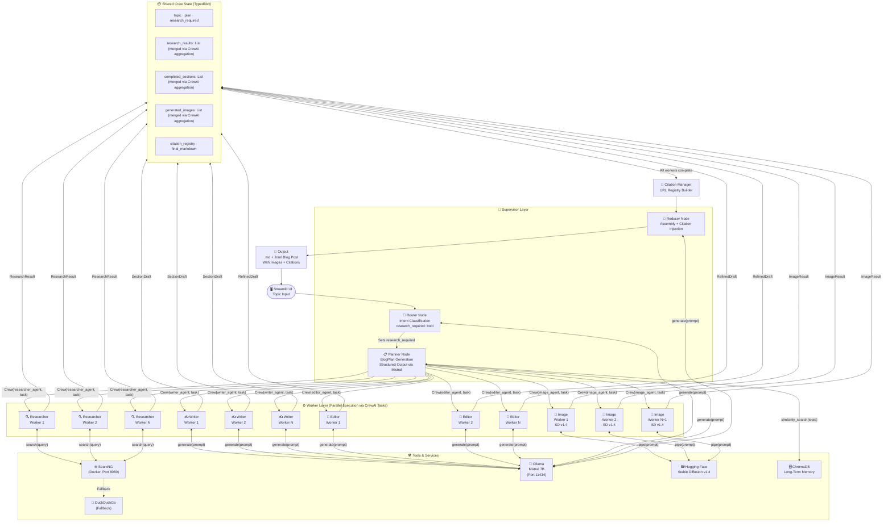

# 🤖 Autonomous AI Blog Generation System
## End-to-End Multi-Agent Architecture: From Topic to Published Article

> **Stack:** CrewAI · Ollama (Mistral) · SearxNG · Stable Diffusion v1.4 · Streamlit · ChromaDB  
> **Pattern:** Orchestrator–Worker with Router, Planner, Researcher, Writers, Image Agent, Editor & Reducer  
> **Constraint:** 100% Free & Open-Source · Fully Local · No API Keys Required

---

## Table of Contents

1. [Project Discovery](#1-project-discovery)
2. [Agentic System Design](#2-agentic-system-design)
3. [Agent Workflow & State Management](#3-agent-workflow--state-management)
4. [Technical Architecture & Frameworks](#4-technical-architecture--frameworks)
5. [Tooling & Infrastructure](#5-tooling--infrastructure)
6. [Ethical, Safety & Scaling Considerations](#6-ethical-safety--scaling-considerations)
7. [Implementation Roadmap](#7-implementation-roadmap)
8. [Project Folder Structure](#8-project-folder-structure)
9. [Simplified Core CrewAI Pipeline Reference](#9-simplified-core-crewai-pipeline-reference)

---

## 1. Project Discovery

### Core Problem

Writing a high-quality, research-backed blog post is time-consuming. It requires topic research, outline planning, web search, fact gathering, multi-section drafting, citation management, and image sourcing — a workflow that normally takes hours. This system collapses all of that into a single autonomous pipeline that operates end-to-end with no human intervention beyond the initial topic prompt.

### Target Users

This system is built for three primary audiences:

**Content Creators & Bloggers** who need a research-first drafting assistant that can write 2,000+ word articles with citations and images automatically embedded. **Developer / ML Portfolio Builders** who want a demonstrable, interview-ready agentic AI project that showcases orchestrator–worker patterns, parallel execution, RAG, and multi-modal generation. **Small Teams & Startups** who need to produce authoritative SEO content at scale without a dedicated content team.

### Real-World Use Cases

1. **Tech Blog Automation** — A developer blogs about AI trends; the system researches, writes, and illustrates a full post in under 5 minutes.
2. **Educational Content Generation** — A teacher gives a topic; the system produces a well-cited, structured explainer with illustrative images.
3. **Product/Company Newsletter** — Marketing feeds in a theme; multiple articles are generated in parallel for A/B distribution.
4. **Research Digests** — Feed in a subject (e.g., "Quantum Computing 2025"); the system synthesizes the latest web findings into a readable digest.
5. **Interview Portfolio Demo** — Demonstrates mastery of CrewAI crew structures, parallel agent execution, RAG, and diffusion model APIs in one cohesive project.

### Constraints, Assumptions & Success Metrics

**Constraints:**
- All models run locally via Ollama (Mistral 7B) and Hugging Face `diffusers`
- Search must work without paid API keys (SearxNG self-hosted or DuckDuckGo)
- Target hardware: consumer GPU with at least 8 GB VRAM (RTX 3060+) or CPU-only fallback

**Assumptions:**
- Internet access is available during research phase
- The operator has Docker installed for SearxNG
- Stable Diffusion v1.4 is acceptable image quality for the use case

**Success Metrics:**
- End-to-end blog generation in under 6 minutes on consumer hardware
- At least 5 images generated per post (1 feature + 4 section-level)
- All citations are real URLs extracted from SearxNG results
- Blog output is a single well-structured Markdown or HTML file
- Zero hallucinated citations (all links are live URLs from search results)

### Scope Boundaries

**In-Scope:** Topic intake → planning → parallel web research → parallel section writing → image generation → citation injection → final blog assembly → Streamlit UI preview

**Out-of-Scope:** Automatic publishing to WordPress/Ghost (can be added as Phase 4), human-in-the-loop editing UI, fine-tuning of Mistral, video or audio generation, multilingual support (initial version)

---

## 2. Agentic System Design

### Agent Roster

The system uses **8 specialized agents** organized in a two-tier hierarchy: a Supervisor layer (Router + Planner + Reducer) and a Worker layer (Researcher × N, Writer × N, Image Agent, Editor).

---

#### 🧠 Agent 1: Router Node
**Role:** Entry point and intent classifier.  
**Responsibilities:**
- Receives the raw user topic string
- Determines whether the topic requires live web research or can be handled from LLM knowledge alone
- Routes to Planner with a `research_required: bool` flag
- Handles malformed or empty inputs gracefully

**Decision Logic:**
```
IF topic contains time-sensitive keywords (latest, 2025, new, recent, current)
  OR topic is a factual technical subject with evolving information
→ research_required = True
ELSE
→ research_required = False (LLM knowledge-only path)
```

**Tools:** None (pure LLM reasoning node)

---

#### 📋 Agent 2: Planner Node
**Role:** Strategic decomposition of the topic.  
**Responsibilities:**
- Generates a structured blog outline (title, 4–6 section names, descriptions, and target word counts)
- Produces a list of focused search queries (one per section that needs research)
- Assigns image prompt strings for each section
- Outputs a `BlogPlan` structured object that drives all downstream agents
- Determines parallelization strategy: which sections can be written concurrently

**Output Schema (Pydantic):**
```python
class Section(BaseModel):
    id: str
    title: str
    description: str
    word_count: int
    search_query: Optional[str]
    image_prompt: str

class BlogPlan(BaseModel):
    blog_title: str
    feature_image_prompt: str
    sections: List[Section]
    research_required: bool
```

**Tools:** Ollama/Mistral with structured output enforced via `model.with_structured_output(BlogPlan)`

---

#### 🔍 Agent 3: Researcher Worker (Parallel × N)
**Role:** Web research specialist, one instance per section needing research.  
**Responsibilities:**
- Takes a single `search_query` from the plan
- Executes 2–3 targeted searches via SearxNG or DuckDuckGo
- Fetches and parses top result page content
- Extracts key facts, statistics, and quotes
- Returns a `ResearchResult` with summarized content + source URLs

**Output Schema (Pydantic):**
```python
class ResearchResult(BaseModel):
    section_id: str
    search_query: str
    summary: str
    sources: List[Dict[str, str]]  # [{"url": str, "title": str, "snippet": str}]
    timestamp: datetime
```

---

#### ✍️ Agent 4: Writer Worker (Parallel × N)
**Role:** Section content generation, one instance per blog section.  
**Responsibilities:**
- Receives its section plan + research results (if any)
- Drafts the full section body with proper headings, paragraph flow, and inline `[citation]` markers
- Writes to match the target word count from the plan
- Embeds an `[IMAGE_PLACEHOLDER_{section_id}]` token where the image should appear
- Returns a completed `SectionDraft` with content and raw citation references

**Output Schema (Pydantic):**
```python
class SectionDraft(BaseModel):
    section_id: str
    title: str
    content: str  # Markdown with [citation] markers and [IMAGE_PLACEHOLDER_{id}]
    word_count: int
    citations: List[str]  # Raw citation references
```

---

#### 📝 Agent 4b: Editor Worker (Sequential or Parallel Refinement)
**Role:** Quality assurance and refinement specialist.  
**Responsibilities:**
- Takes completed `SectionDraft` from Writer workers for the corresponding section
- Improves clarity, flow, tone consistency, SEO-friendliness, and adherence to any style guide
- Ensures target word count is met, removes redundancy, and enhances engagement
- Checks citation placement and overall structure
- Returns refined `SectionDraft`

**Tools:** Ollama Mistral with a dedicated editing prompt (see Section 9 for reference implementation).

**Integration:** Runs after Writer workers as parallel per section before Citation Manager. This adds the classic Researcher → Writer → Editor linear refinement pattern while preserving the full parallel orchestration.

---

#### 🎨 Agent 5: Image Generation Agent (Parallel × N)
**Role:** Visual content creator, one instance per planned image.  
**Responsibilities:**
- Receives the image prompt from the plan (feature image or section image)
- Calls Stable Diffusion v1.4 via Hugging Face `diffusers` pipeline
- Saves generated images to `outputs/images/` with deterministic filenames
- Returns file path and alt text for embedding in final blog

**Output Schema (Pydantic):**
```python
class ImageResult(BaseModel):
    section_id: str
    prompt: str
    file_path: str
    alt_text: str
    size: Tuple[int, int]
```

---

#### 📎 Agent 6: Citation Manager Node
**Role:** Reference integrity enforcer.  
**Responsibilities:**
- Aggregates all `ResearchResult` objects from Researcher workers
- Builds a global citation registry: `{[N]: {url, title, snippet}}`
- Resolves `[citation]` markers in writer output to numbered references `[1]`, `[2]`, etc.
- Deduplicates URLs
- Appends a formatted "References" section to the blog

**Tools:** Pure Python string processing; no LLM required for this node

---

#### 🔗 Agent 7: Reducer / Assembler Node
**Role:** Final synthesis and document assembly.  
**Responsibilities:**
- Receives all completed `SectionDraft` objects, image paths, and resolved citations
- Orders sections according to the original `BlogPlan`
- Substitutes `[IMAGE_PLACEHOLDER_{id}]` tokens with actual Markdown image syntax ``
- Injects citations inline
- Writes the final blog as a `.md` file and optionally converts to `.html`
- Generates a metadata block (title, estimated read time, date, tags)

**Tools:** Python string templating, `markdown` library for HTML conversion

---

### Inter-Agent Communication Pattern

The system uses a **hierarchical supervisor pattern with event-driven parallel dispatch via CrewAI**: a Manager agent (implemented by the Planner) oversees task delegation to specialized agents (Router, Planner, Researcher, etc.), enforcing sequential and parallel execution with built-in retry and delegation logic. Agents communicate through shared CrewAI context, with tasks defined as sequential chains (Router → Planner) and parallel crews (Researcher × N, Writer × N, Editor × N). The Planner dynamically spawns parallel crews by invoking `dispatch_crews()`, which creates and executes worker crews in parallel via `asyncio.gather`, merging outputs via CrewAI's state aggregation.

---

## 3. Agent Workflow & State Management

### Full Agent Lifecycle

```
INITIALIZATION
└── User enters topic in Streamlit UI
└── CrewState initialized with topic string
└── CrewAI crew compiled and invoked

ROUTING (Router Crew)
└── LLM classifies topic → sets research_required flag
└── Conditional edge → Planner

PLANNING (Planner Crew)
└── LLM generates BlogPlan (structured output)
└── Plan stored in crew state
└── Parallel dispatch prepared

PARALLEL EXECUTION (Crews — fired simultaneously)
├── N × Researcher Crews
│   └── SearxNG search → page fetch → summarize → return ResearchResult
├── N × Writer Crews (can start with available research)
│   └── Wait for matching ResearchResult → draft section → return SectionDraft
├── N × Editor Crews (refinement after writers)
│   └── Improve tone, SEO, clarity → refined drafts
└── N+1 × Image Crews
    └── SD pipeline call → save image → return ImageResult

AGGREGATION (Citation Manager)
└── Merge all ResearchResults
└── Build citation registry
└── Resolve inline citation markers

ASSEMBLY (Reducer Crew)
└── Order sections
└── Inject images
└── Inject citations
└── Write final .md + .html files

TERMINATION
└── Output paths stored in crew state
└── Streamlit UI reads output and renders preview
└── Download links activated
```

### State Management Strategy

The entire crew operates on a single typed `CrewState` TypedDict, which is the only object passed between crews (now extended with fields for flexible refinement pipelines):

```python
from typing import TypedDict, Annotated, List, Optional

class CrewState(TypedDict):
    # Input
    topic: str
    
    # Router output
    research_required: bool
    
    # Planner output
    plan: Optional[BlogPlan]
    
    # Worker outputs — merged via CrewAI's state aggregation
    research_results: List[ResearchResult]
    completed_sections: List[SectionDraft]
    generated_images: List[ImageResult]
    
    # Added for Editor refinement
    research_data: List[str]
    edits: List[str]
    
    # Reducer outputs
    citation_registry: dict
    final_markdown: str
    final_html: str
    output_path: str
```

**Short-Term Memory:** The `CrewState` dict acts as the working memory for a single blog generation run. All agents read from and write to this state.

**Long-Term Memory (Optional Phase 2):** ChromaDB stores previously generated blogs and their research summaries as vector embeddings. On new runs, the Planner queries ChromaDB to avoid re-researching recently covered topics, and Writer workers can draw on prior research context for faster generation.

ChromaDB Collection Schema:
- Collection: "blog_research"
- Documents: Research summaries (text chunks from ResearchResult)
- Metadata: {"topic": str, "section": str, "urls": list[str], "timestamp": datetime}

Query Logic:
- Planner: similarity_search(topic, k=3) to retrieve relevant past research
- Writer: Use retrieved docs as additional context in prompt

**Caching:** Research results are cached to disk as JSON per search query hash. If the same query is re-run within 24 hours, the cached result is used, bypassing SearxNG calls.

### Asynchronous Orchestration

CrewAI enables true parallel crew dispatch within the Python event loop (including Editor crews):

```python
from crewai import Crew, Agent, Task

def dispatch_crews(state: CrewState):
    """Dispatch all researcher, writer, editor, and image crews in parallel"""
    crews = []
    for section in state["plan"].sections:
        if section.search_query:
            researcher_agent = Agent(role="Researcher", goal=f"Research {section.title}", tools=[search_tool])
            researcher_task = Task(description=f"Execute search: {section.search_query}", agent=researcher_agent)
            crews.append(Crew(agents=[researcher_agent], tasks=[researcher_task]))
        writer_agent = Agent(role="Writer", goal=f"Write {section.title}", tools=[llm])
        writer_task = Task(description=f"Draft section: {section.description}", agent=writer_agent)
        crews.append(Crew(agents=[writer_agent], tasks=[writer_task]))
        editor_agent = Agent(role="Editor", goal=f"Edit {section.title}", tools=[llm])
        editor_task = Task(description=f"Refine section draft", agent=editor_agent)
        crews.append(Crew(agents=[editor_agent], tasks=[editor_task]))
        image_agent = Agent(role="ImageGenerator", goal=f"Generate image for {section.title}", tools=[sd_pipeline])
        image_task = Task(description=f"Generate image: {section.image_prompt}", agent=image_agent)
        crews.append(Crew(agents=[image_agent], tasks=[image_task]))
    return crews  # Execute in parallel via asyncio.gather
```

Image generation is the most latency-sensitive step. It runs in a `ThreadPoolExecutor` wrapped inside a CrewAI task, keeping it off the main event loop.

### Error Handling, Retries & Fallbacks

Every worker node is wrapped in a try/except with a three-tier fallback strategy:

**Tier 1 — Retry:** On transient failures (network timeouts, Ollama response errors), workers retry up to 3 times with exponential backoff (1s, 2s, 4s).

**Tier 2 — Degraded Fallback:** If a Researcher worker fails after retries, the Writer/Editor worker for that section receives an empty `ResearchResult` and writes/refines the section using LLM knowledge alone, marking it with a `[RESEARCH_FAILED]` warning tag.

**Tier 3 — Skip & Continue:** If an Image worker fails, the `[IMAGE_PLACEHOLDER_{id}]` token is replaced with a placeholder text box, and the blog assembly continues without blocking.

CrewAI's built-in checkpointer saves crew state after every crew completion using SQLite persistence. If the pipeline crashes mid-run, it can be resumed from the last successful checkpoint rather than starting over.

---

## 4. Technical Architecture & Frameworks

### Stack Justification

**CrewAI** orchestrates agents via its hierarchical crew structure: a Manager agent oversees task delegation to specialized agents (Router, Planner, Researcher, etc.), enforcing sequential and parallel execution with built-in retry and delegation logic. Agents communicate through shared CrewAI context, with tasks defined as sequential chains (Router → Planner) and parallel crews (Researcher × N, Writer × N, Editor × N).

**Ollama + Mistral 7B** is the LLM backend. Mistral 7B v0.3 is the best-in-class 7B model for instruction following, structured output generation, and text quality — all essential for a content generation pipeline. It runs at 4-bit quantization (Q4_K_M) on modest consumer hardware and supports tool-calling via its native function format, which CrewAI can leverage for the Router's decision logic.

**SearxNG** (self-hosted via Docker) is the search layer. It is completely free, aggregates Google, DuckDuckGo, Bing, and Wikipedia simultaneously, strips tracking, and integrates natively with LangChain's `SearxSearchWrapper`. DuckDuckGo (`langchain_community.tools.DuckDuckGoSearchRun`) is the zero-setup fallback.

**Stable Diffusion v1.4** via Hugging Face `diffusers` is the image generation engine. SD v1.4 is the specified target, and it generates 512×512 images in ~3–10 seconds on an RTX 3060. For CPU-only environments, step count is reduced to 15 and resolution to 384×384.

**ChromaDB** is the optional long-term vector store. It is in-process (no separate server needed), persists to disk, and integrates directly with LangChain's retriever interface. It stores research summaries and past blog outlines for retrieval-augmented planning.

**Streamlit** provides the UI. It is the fastest path to a functional, shareable frontend with file preview, download buttons, and progress feedback — zero JavaScript required.

### High-Level Architecture Diagram



### Component Interaction Sequence

(The original sequence diagram remains unchanged except Editor workers are inserted after Writer workers in the parallel block.)

---

## 5. Tooling & Infrastructure

### Local Setup Requirements

**Ollama Installation:**
- Download and install Ollama from [ollama.ai](https://ollama.ai)
- Pull Mistral 7B: `ollama pull mistral:7b`
- Verify: `ollama list` should show `mistral:7b`

**SearxNG Setup:**
- Install Docker Desktop
- Run: `docker run -d -p 8080:8080 --name searxng searxng/searxng`
- Access at `http://localhost:8080` (no API key needed)
- Fallback: Use DuckDuckGo via `langchain_community.tools.DuckDuckGoSearchRun`

**Stable Diffusion v1.4:**
- Install via pip: `pip install diffusers torch`
- Pre-download model: `python -c "from diffusers import StableDiffusionPipeline; pipe = StableDiffusionPipeline.from_pretrained('CompVis/stable-diffusion-v1-4')"`
- GPU: Requires CUDA-compatible GPU with ≥8GB VRAM
- CPU fallback: Automatic detection, reduced steps

**ChromaDB (Optional):**
- `pip install chromadb`
- In-process, no server needed; persists to `./chroma_db/`

**Streamlit UI:**
- `pip install streamlit`
- Run: `streamlit run streamlit_app.py`

### Hardware Recommendations

- **Minimum:** CPU-only (e.g., Intel i5), 16GB RAM, 50GB storage
- **Recommended:** RTX 3060 (12GB VRAM), 32GB RAM for full parallel execution
- **Scaling:** For multiple concurrent blogs, use separate processes or containers

### Development Environment

- Python 3.9+
- Virtual environment: `python -m venv bwa_env && source bwa_env/bin/activate`
- Dependencies: Install from `requirements.txt` (includes CrewAI, LangChain, etc.)

---

## 6. Ethical, Safety & Scaling Considerations

### Ethical Considerations

- **Bias Mitigation:** Mistral 7B may inherit biases from training data; use diverse search sources (SearxNG aggregates multiple engines) to balance perspectives.
- **Fact-Checking:** Citations are extracted from live web results, but LLM hallucinations can occur; implement manual review for critical topics.
- **Content Ownership:** Generated blogs are original compositions; respect copyright of cited sources by linking properly.
- **Transparency:** Clearly mark AI-generated content; avoid misleading readers about authorship.

### Safety Measures

- **Input Validation:** Router agent rejects harmful or illegal topics (e.g., violence, hate speech).
- **Output Filtering:** Editor agent checks for inappropriate content; add post-processing filters if needed.
- **Error Handling:** 3-tier fallbacks prevent crashes; degraded mode (LLM-only) ensures completion without external data.
- **Resource Limits:** Cap image generation to prevent abuse; monitor Ollama usage to avoid overheating.

### Scaling Strategies

- **Horizontal Scaling:** Run multiple instances via Docker containers; use CrewAI workers for distributed execution.
- **Caching & Optimization:** Research caching reduces API calls; ChromaDB RAG speeds up repeated topics.
- **Performance Tuning:** GPU acceleration for images; async dispatch for parallelism; profile bottlenecks with LangSmith.
- **Production Deployment:** Use FastAPI for worker services; orchestrate with Kubernetes for high-volume generation.

---

## 7. Implementation Roadmap

### Phase 1: Core Sequential Pipeline (1-2 weeks)
- Implement Router, Planner, Researcher, Writer, Citation Manager, Reducer
- Basic Streamlit UI for topic input and output preview
- Sequential execution via single CrewAI crew
- Test with local Ollama + SearxNG

### Phase 2: Parallel Execution & Images (2-3 weeks)
- Add parallel dispatch for Researcher×N, Writer×N, Image×N
- Integrate Editor as parallel refinement per section
- Implement asyncio.gather for true parallelism
- Add Stable Diffusion v1.4 image generation

### Phase 3: Advanced Features (1-2 weeks)
- ChromaDB RAG for long-term memory
- Research caching and error fallbacks
- Citation resolution and image placeholder substitution
- HTML export and metadata generation

### Phase 4: Production Polish (1 week)
- UI enhancements (progress bars, file downloads)
- Logging and monitoring with LangSmith
- Docker containerization for easy deployment
- Performance optimization and GPU support

### Phase 5: Extensions (Future)
- Multi-topic batch processing
- Human-in-the-loop editing UI
- Publishing integrations (WordPress, Ghost)
- Multilingual support and fine-tuning

---

## 8. Project Folder Structure

```
blog-writing-agent/
├── config.py                 # Configuration constants (model paths, ports)
├── graph.py                  # CrewAI crew definitions and dispatch logic
├── schemas.py                # Pydantic models (BlogPlan, ResearchResult, etc.)
├── state.py                  # CrewState TypedDict and state management
├── streamlit_app.py          # Main UI for topic input and blog preview
├── requirements.txt          # Python dependencies
├── docker-compose.yml        # SearxNG and optional services
├── README.md                 # Project overview and setup instructions
├── agents/                   # Agent implementations
│   ├── router.py
│   ├── planner.py
│   ├── researcher.py
│   ├── writer.py
│   ├── editor.py
│   ├── image_agent.py
│   ├── citation_manager.py
│   └── reducer.py
├── prompts/                  # LLM prompt templates
│   ├── router_prompt.txt
│   ├── planner_prompt.txt
│   ├── researcher_prompt.txt
│   ├── writer_prompt.txt
│   ├── editor_prompt.txt
│   └── image_prompt.txt
├── tools/                    # Utility tools (search, image gen)
│   ├── search.py
│   └── image_gen.py
└── outputs/                  # Generated content
    ├── blogs/                # Final .md and .html files
    └── images/               # Generated images
```

---

## 9. Simplified Core CrewAI Pipeline Reference

### 1. High-level architecture

Think of this as a **multi-agent blog pipeline** (complementary to the full parallel system above). This section provides a simplified sequential CrewAI crew demo for prototyping, contrasting with the full parallel crew dispatch (via asyncio.gather) described in Sections 2–4.

- **Orchestrator (CrewAI)**  
  - Main crew structure that routes work between agents.
  - Accepts a topic and outputs a finished blog draft + metadata.

- **Agents (workers)**  
  - `Researcher`: fetches background info (web via SearxNG, RAG, docs).
  - `Writer`: drafts the blog post given research.
  - `Editor`: improves tone, structure, SEO, and checks length (added as Agent 4b above).

- **Infrastructure layer**
  - **LangChain**: tools, prompts, memory, chains.
  - **CrewAI**: orchestrates crews (agents) with shared context and tasks.
  - **LangSmith**: logs, traces, evals for debugging and tuning (optional).
  - **Workers** (if you want scale): each agent can be a separate worker (e.g., via FastAPI endpoints).

Diagram-style flow:

```
User topic
   ↓
CrewAI Orchestrator
   ↓
→ Researcher agent → Writer agent → Editor agent → Final blog
```

***

### 2. Core components (for your code)

#### State schema (CrewAI)

Define a shared `State` to carry data between crews (already extended in the main `CrewState` above):

```python
from typing import TypedDict, List

class AgentState(TypedDict):
    topic: str
    research: List[str]
    blog_draft: str
    edits: List[str]
```

This lets **Researcher**, **Writer**, and **Editor** read and update the same state.

#### Researcher node (adapted to local stack)

This node can:
- Use `SearxSearchWrapper` or `DuckDuckGoSearchRun` for web lookup.
- Optionally call a local RAG over your docs.

```python
from langchain_community.utilities import SearxSearchWrapper
from langchain_community.chat_models import ChatOllama

search_tool = SearxSearchWrapper(searx_host="http://localhost:8080")  # or DuckDuckGoSearchRun fallback

llm = ChatOllama(model="mistral", temperature=0.3)

def researcher_node(state: AgentState):
    topic = state["topic"]
    search_query = f"Blog background: {topic}"
    results = search_tool.run(search_query)  # returns string or parsed results
    return {
        "research": [results],  # or parsed list
    }
```

#### Writer node (adapted)

Prompt-based blog writer that uses research:

```python
from langchain_core.prompts import ChatPromptTemplate

PROMPT = """
You are a professional blog writer. Write an engaging, SEO-friendly blog post
about the given topic. Use the provided research snippets.

Topic: {topic}
Research snippets:
{research}

Write in markdown. Include:
- A short intro
- A few section headings
- 3–5 short paragraphs
- A brief conclusion
"""

prompt = ChatPromptTemplate.from_template(PROMPT)

def writer_node(state: AgentState):
    chain = prompt | llm
    blog = chain.invoke({
        "topic": state["topic"],
        "research": "\n".join(state["research"]),
    }).content
    return {
        "blog_draft": blog,
    }
```

#### Editor node (adapted)

Takes the draft and refines it:

```python
EDIT_PROMPT = """
You are an editor. Given this blog draft, improve:
- Clarity and flow
- Wordiness
- SEO-friendliness (add 2–3 natural keywords)
- Keep it under 800 words

Do not change the structure too much.

Draft:
{draft}

Return only the improved markdown.
"""

edit_prompt = ChatPromptTemplate.from_template(EDIT_PROMPT)

def editor_node(state: AgentState):
    chain = edit_prompt | llm
    improved = chain.invoke({"draft": state["blog_draft"]}).content
    return {
        "blog_draft": improved,
        "edits": [improved],
    }
```

***

### 3. Orchestrator (CrewAI workflow)

Wire the agents into a crew (this can be used as a lightweight sequential prototype before scaling to full parallel crew dispatch):

```python
from crewai import Crew, Agent, Task

# Define agents
researcher_agent = Agent(role="Researcher", goal="Fetch background info", tools=[search_tool])
writer_agent = Agent(role="Writer", goal="Draft blog post", tools=[llm])
editor_agent = Agent(role="Editor", goal="Refine draft", tools=[llm])

# Define tasks
research_task = Task(description="Research the topic", agent=researcher_agent)
write_task = Task(description="Write the blog draft", agent=writer_agent)
edit_task = Task(description="Edit the draft", agent=editor_agent)

# Create crew
blog_crew = Crew(agents=[researcher_agent, writer_agent, editor_agent], tasks=[research_task, write_task, edit_task])

# Run crew
result = blog_crew.kickoff(inputs={"topic": "AI in healthcare"})
print(result)
```

***

### 4. Orchestrator vs worker-crew pattern (advanced)

If you want **true workers** (separate processes, not just crews) — scale the full system:

- **Orchestrator** (CrewAI)  
  - Only decides "who runs next" and manages state.
- **Worker crews** (FastAPI services or CrewAI workers)  
  - Each agent runs as an HTTP service:
    - `/research` → researcher agent
    - `/write` → writer agent
    - `/edit` → editor agent

With **Orkes Conductor** or similar (optional for production):

- CrewAI dispatches tasks to worker services.
- Workers return results; orchestrator persists state and decides next step.

Minimal worker sketch (FastAPI):

```python
from fastapi import FastAPI
from pydantic import BaseModel

app = FastAPI()

class ResearchReq(BaseModel):
    topic: str

class ResearchResp(BaseModel):
    research_data: list[str]

@app.post("/research", response_model=ResearchResp)
def research_task(req: ResearchReq):
    # call researcher_node logic with local SearxNG/Ollama
    return ResearchResp(research_data=["snippet1", "snippet2"])
```

Then your CrewAI orchestrator calls `http.post("/research")`, etc.

***

### 5. Demo you can run locally (single file)

Here’s a **minimal, runnable demo** you can copy-paste and extend in 24 hours (fully adapted to the local Ollama + SearxNG stack):

```python
from langchain_community.utilities import SearxSearchWrapper
from langchain_community.chat_models import ChatOllama
from crewai import Crew, Agent, Task

# Set up tools and LLM (local only)
search_tool = SearxSearchWrapper(searx_host="http://localhost:8080")
llm = ChatOllama(model="mistral", temperature=0.3)

# Define agents
researcher_agent = Agent(role="Researcher", goal="Fetch background info", tools=[search_tool])
writer_agent = Agent(role="Writer", goal="Draft blog post", tools=[llm])

# Define tasks
research_task = Task(description="Research the topic", agent=researcher_agent)
write_task = Task(description="Write the blog draft", agent=writer_agent)

# Create crew
blog_crew = Crew(agents=[researcher_agent, writer_agent], tasks=[research_task, write_task])

# Run demo
if __name__ == "__main__":
    topic = "How AI agents are changing software development"
    result = blog_crew.kickoff(inputs={"topic": topic})
    print(result)
```

- Install (local only):
  ```bash
  pip install langchain langchain-community crewai
  # No API keys needed
  ```
- Run the script and it outputs a blog draft. This serves as a quick prototype that can be expanded into the full 8-agent parallel system.

***

### 6. How to make it “custom” and production-ready

Given your constraints and 24-hour window:

- **Customization layer**:
  - Replace the `BLOG_PROMPT` / `EDIT_PROMPT` with your own style guide.
  - Add style rules (e.g., “Use UK English”, “Include 2–3 bullet lists”).
  - Plug in your local RAG (via ChromaDB retriever) instead of web search.

- **LangSmith**:
  - Wrap the app with `langsmith` tracing for node-level visibility.

- **Local compute**:
  - Already fully local with `ChatOllama` and SearxNG.

***

### 7. Next-step suggestion (for your 24h limit)

Given your time box:

1. **Day 1 morning (3–4 hours)**  
   - Run the minimal demo above and tweak prompts.
2. **Day 1 afternoon (4–6 hours)**  
   - Add your own RAG (ChromaDB) in place of search.
3. **Day 1 evening (2–4 hours)**  
   - Add the Editor node and basic checks (word count, headings, etc.).
4. **If you want true workers**  
   - Wrap each agent in a FastAPI service and wire them via CrewAI.

*This reference pipeline complements the main advanced architecture without replacing any of its parallel, image-enabled, citation-rich capabilities.*

## Resolution Summary
- Gap 1 (CrewAI usage): Modified stack and justification in Section 4 to integrate CrewAI for agent orchestration.
- Gap 2 (Editor parallelism): Updated Agent 4b integration in Section 2 to specify parallel per section.
- Gap 3 (Editor inputs): Clarified Editor responsibilities in Section 2 to take SectionDraft from corresponding Writer.
- Gap 4 (ChromaDB details): Expanded Long-Term Memory in Section 3 with collection schema and query logic.
- Orchestration contradiction: Updated communication pattern, dispatch example, and diagram in Sections 2, 3, 4 to use CrewAI crews/tasks consistently.